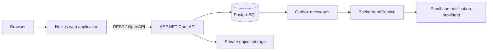
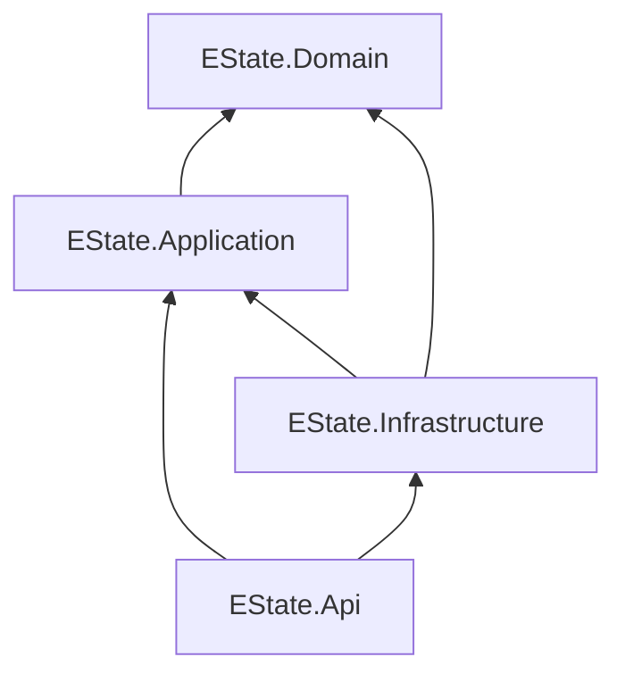

# e-state Backend Architecture

**Status:** Planned  
**Backend repository:** `e-state-api`  
**Frontend repository:** `e-state-web`

## 1. Purpose

e-state is an Irish property sales platform that combines property listings with a lightweight transaction workspace. The backend will support real buyers, sellers, and professionals, so important workflows, permissions, audit history, and document access must be enforced by the backend.

This document records the intended backend architecture and the conventions to follow when the backend repository is created.

## 2. Architecture summary

The backend will be:

> An explicit vertical-slice modular monolith with pragmatic Clean Architecture boundaries, a behavioral domain model, and lightweight CQRS.

In practical terms:

| Concern | Decision |
| --- | --- |
| Deployment | One ASP.NET Core modular monolith |
| Database | One PostgreSQL database |
| Code boundaries | `Api`, `Application`, `Domain`, and `Infrastructure` projects |
| Organization | Business modules and vertical use-case slices |
| Writes | Explicit command handlers, domain behavior, repositories, and one transaction |
| Reads | Direct EF Core, Dapper, or SQL projections into response models |
| Request dispatch | Explicit endpoint-to-handler method calls |
| Background work | PostgreSQL outbox processed by `BackgroundService` |
| Files | Private S3-compatible object storage |
| API | REST with OpenAPI; no URL version prefix initially |

The architecture deliberately avoids:

- microservices;
- event sourcing;
- separate read and write databases;
- generic repositories;
- MediatR or MinimalCQRS as a required dispatch layer;
- internal event chains for workflows that require immediate consistency;
- a class, interface, or abstraction solely to satisfy an architecture diagram.

## 3. System boundary

The frontend and backend live in separate repositories and communicate only through REST/OpenAPI.



The backend owns:

- authentication integration and authorization;
- database schema and migrations;
- business rules and workflow state;
- offer history and audit records;
- document metadata, storage keys, and access checks;
- required-document matching;
- activity records, notifications, and action items;
- background jobs and outbox processing.

The frontend owns:

- UI and presentation;
- Next.js routing;
- forms and client-side interaction;
- frontend-facing models;
- API adapters and generated OpenAPI transport types.

The frontend must not reproduce backend permission, document-matching, or workflow rules.

## 4. Repository and solution structure

The backend repository should begin with the following structure:

```text
e-state-api/
  EState.sln

  src/
    EState.Api/
      Program.cs
      Auth/
      Modules/

    EState.Application/
      Abstractions/
      Modules/

    EState.Domain/
      Modules/

    EState.Infrastructure/
      Auth/
      Persistence/
      Storage/
      Outbox/
      Notifications/

  tests/
    EState.Domain.Tests/
    EState.IntegrationTests/

  db/
    seeds/
    dev/

  docker-compose.yml
```

Each `.csproj` is a separate .NET build unit and produces its own assembly. Publishing `EState.Api` includes its referenced assemblies, so the result remains one deployable application rather than several services.

### Project references



The dependency rules are:

- `Domain` references no other e-state project.
- `Application` references `Domain`.
- `Infrastructure` references `Application` and `Domain` to implement their abstractions.
- `Api` references `Application` and `Infrastructure` and acts as the composition root.

These project references let the compiler prevent Domain from using ASP.NET, PostgreSQL, EF Core, S3, or email-provider types.

## 5. Business modules

Initial modules will likely include:

```text
Identity
Users
Properties
Listings
Offers
Sales
Documents
Tasks
Notifications
Activity
Audit
```

Modules are initially organizational boundaries, not separate services or databases. Important application workflows may coordinate several modules directly when they must complete in one transaction.

For example, `AcceptOffer` may use domain objects and repositories owned by Offers, Listings, and Sales. Interfaces or asynchronous events should not be introduced merely to disguise that real business dependency.

## 6. Vertical slices

A vertical slice represents one complete user action or query. Everything unique to that use case is colocated.

```text
EState.Application/
  Modules/
    Listings/
      CreateListing/
        CreateListingCommand.cs
        CreateListingHandler.cs
        CreateListingResult.cs
        CreateListingValidator.cs

      GetListing/
        GetListingQuery.cs
        GetListingHandler.cs
        GetListingResult.cs
        IListingReader.cs
```

Shared objects do not belong to an individual slice:

```text
EState.Domain/Modules/Listings/Listing.cs
EState.Infrastructure/Persistence/Repositories/ListingRepository.cs
```

This makes the structure feature-first without duplicating shared domain or infrastructure code.

## 7. Pragmatic domain-driven design

Domain-driven design is used where e-state has meaningful business behavior. Entities expose business operations instead of allowing arbitrary property mutation.

Prefer:

```csharp
offer.Accept();
listing.MarkSaleAgreed(offer.Id);
```

Avoid:

```csharp
offer.Status = OfferStatus.Accepted;
listing.Status = ListingStatus.SaleAgreed;
```

An entity protects its own invariants:

```csharp
public sealed class Offer
{
    public OfferStatus Status { get; private set; }

    public void Accept()
    {
        if (Status != OfferStatus.Pending)
        {
            throw new InvalidOperationException(
                "Only pending offers can be accepted."
            );
        }

        Status = OfferStatus.Accepted;
    }
}
```

Pragmatic DDD does not require value objects, domain services, interfaces, or domain events for every piece of data. Rich behavior is most valuable for offers, listings, sales, verification, permissions, documents, and tasks. Simple read records may remain simple.

## 8. Lightweight CQRS

Commands change state:

```text
CreateListing
SubmitOffer
AcceptOffer
UploadDocument
CompleteTask
```

Queries read state:

```text
GetListing
GetOfferHistory
GetSaleDocuments
GetUserTasks
```

Both use the same application and PostgreSQL database. No command bus, mediator, separate read database, or projection service is required.

Writes normally load domain entities and call business methods. Reads can project directly into the shape required by an API response.

## 9. Explicit request handling

Endpoints must call handlers explicitly:

```csharp
var command = new CreateListingCommand(
    request.Title,
    request.Address,
    request.AskingPriceEur
);

var result = await handler.Handle(
    command,
    cancellationToken
);

return Results.Created(
    $"/api/listings/{result.ListingId}",
    result
);
```

Avoid hiding this flow behind a generic dispatcher unless a concrete future need justifies one.

## 10. Create listing example

### Domain entity

```csharp
namespace EState.Domain.Modules.Listings;

public enum ListingStatus
{
    Draft,
    Published,
    SaleAgreed,
    Archived
}

public sealed class Listing
{
    private Listing()
    {
    }

    private Listing(
        Guid id,
        Guid sellerId,
        string title,
        string address,
        decimal askingPriceEur,
        DateTimeOffset createdAtUtc)
    {
        Id = id;
        SellerId = sellerId;
        Title = title;
        Address = address;
        AskingPriceEur = askingPriceEur;
        Status = ListingStatus.Draft;
        CreatedAtUtc = createdAtUtc;
    }

    public Guid Id { get; private set; }
    public Guid SellerId { get; private set; }
    public string Title { get; private set; } = string.Empty;
    public string Address { get; private set; } = string.Empty;
    public decimal AskingPriceEur { get; private set; }
    public ListingStatus Status { get; private set; }
    public DateTimeOffset CreatedAtUtc { get; private set; }

    public static Listing Create(
        Guid sellerId,
        string title,
        string address,
        decimal askingPriceEur,
        DateTimeOffset createdAtUtc)
    {
        if (sellerId == Guid.Empty)
        {
            throw new ArgumentException(
                "A listing must have a seller.",
                nameof(sellerId)
            );
        }

        if (string.IsNullOrWhiteSpace(title))
        {
            throw new ArgumentException(
                "A listing must have a title.",
                nameof(title)
            );
        }

        if (string.IsNullOrWhiteSpace(address))
        {
            throw new ArgumentException(
                "A listing must have an address.",
                nameof(address)
            );
        }

        if (askingPriceEur <= 0)
        {
            throw new ArgumentOutOfRangeException(
                nameof(askingPriceEur),
                "The asking price must be greater than zero."
            );
        }

        return new Listing(
            Guid.NewGuid(),
            sellerId,
            title.Trim(),
            address.Trim(),
            askingPriceEur,
            createdAtUtc
        );
    }

    public void Publish()
    {
        if (Status != ListingStatus.Draft)
        {
            throw new InvalidOperationException(
                "Only draft listings can be published."
            );
        }

        Status = ListingStatus.Published;
    }

    public void MarkSaleAgreed(Guid acceptedOfferId)
    {
        if (acceptedOfferId == Guid.Empty)
        {
            throw new ArgumentException(
                "An accepted offer is required.",
                nameof(acceptedOfferId)
            );
        }

        if (Status != ListingStatus.Published)
        {
            throw new InvalidOperationException(
                "Only published listings can become sale agreed."
            );
        }

        Status = ListingStatus.SaleAgreed;
    }
}
```

### Application abstractions

```csharp
public interface ICurrentUser
{
    Guid UserId { get; }
}

public interface IListingRepository
{
    Task Add(
        Listing listing,
        CancellationToken cancellationToken
    );
}

public interface IUnitOfWork
{
    Task<int> SaveChangesAsync(
        CancellationToken cancellationToken
    );
}
```

The seller ID comes from the authenticated backend user rather than a `seller_id` supplied by the frontend.

### Command, result, and validation

```csharp
public sealed record CreateListingCommand(
    string Title,
    string Address,
    decimal AskingPriceEur
);

public sealed record CreateListingResult(Guid ListingId);
```

```csharp
public sealed class CreateListingValidator
{
    public Dictionary<string, string[]> Validate(
        CreateListingCommand command)
    {
        var errors = new Dictionary<string, string[]>();

        if (string.IsNullOrWhiteSpace(command.Title))
        {
            errors["title"] = ["A title is required."];
        }

        if (string.IsNullOrWhiteSpace(command.Address))
        {
            errors["address"] = ["An address is required."];
        }

        if (command.AskingPriceEur <= 0)
        {
            errors["asking_price_eur"] = [
                "The asking price must be greater than zero."
            ];
        }

        return errors;
    }
}
```

Request validation provides friendly errors. The domain repeats essential invariant checks so invalid entities cannot be created through another entry point.

### Command handler

```csharp
public sealed class CreateListingHandler(
    ICurrentUser currentUser,
    IListingRepository listingRepository,
    IUnitOfWork unitOfWork,
    TimeProvider timeProvider)
{
    public async Task<CreateListingResult> Handle(
        CreateListingCommand command,
        CancellationToken cancellationToken)
    {
        var listing = Listing.Create(
            sellerId: currentUser.UserId,
            title: command.Title,
            address: command.Address,
            askingPriceEur: command.AskingPriceEur,
            createdAtUtc: timeProvider.GetUtcNow()
        );

        await listingRepository.Add(
            listing,
            cancellationToken
        );

        await unitOfWork.SaveChangesAsync(
            cancellationToken
        );

        return new CreateListingResult(listing.Id);
    }
}
```

### Endpoint

```csharp
public sealed record CreateListingRequest(
    string Title,
    string Address,
    decimal AskingPriceEur
);

public static class CreateListingEndpoint
{
    public static async Task<IResult> Handle(
        CreateListingRequest request,
        CreateListingValidator validator,
        CreateListingHandler handler,
        CancellationToken cancellationToken)
    {
        var command = new CreateListingCommand(
            request.Title,
            request.Address,
            request.AskingPriceEur
        );

        var errors = validator.Validate(command);

        if (errors.Count > 0)
        {
            return Results.ValidationProblem(errors);
        }

        var result = await handler.Handle(
            command,
            cancellationToken
        );

        return Results.Created(
            $"/api/listings/{result.ListingId}",
            result
        );
    }
}
```

Runtime flow:

```text
POST /api/listings
→ CreateListingEndpoint
→ CreateListingCommand
→ CreateListingValidator
→ CreateListingHandler
→ Listing.Create()
→ ListingRepository.Add()
→ UnitOfWork.SaveChangesAsync()
→ 201 Created
```

## 11. Get listing example

### Query and result

```csharp
public sealed record GetListingQuery(Guid ListingId);

public sealed record GetListingResult(
    Guid Id,
    string Title,
    string Address,
    decimal AskingPriceEur,
    ListingStatus Status,
    DateTimeOffset CreatedAtUtc
);
```

### Read abstraction and handler

```csharp
public interface IListingReader
{
    Task<GetListingResult?> Get(
        Guid listingId,
        CancellationToken cancellationToken
    );
}

public sealed class GetListingHandler(
    IListingReader listingReader)
{
    public Task<GetListingResult?> Handle(
        GetListingQuery query,
        CancellationToken cancellationToken)
    {
        return listingReader.Get(
            query.ListingId,
            cancellationToken
        );
    }
}
```

### Direct read projection

```csharp
public sealed class ListingReader(
    EStateDbContext database)
    : IListingReader
{
    public Task<GetListingResult?> Get(
        Guid listingId,
        CancellationToken cancellationToken)
    {
        return database.Listings
            .AsNoTracking()
            .Where(listing => listing.Id == listingId)
            .Select(listing => new GetListingResult(
                listing.Id,
                listing.Title,
                listing.Address,
                listing.AskingPriceEur,
                listing.Status,
                listing.CreatedAtUtc
            ))
            .SingleOrDefaultAsync(cancellationToken);
    }
}
```

This query asks PostgreSQL for the columns required by the response. It does not construct a tracked domain entity because no state is being changed.

### Get endpoint

```csharp
public static class GetListingEndpoint
{
    public static async Task<IResult> Handle(
        Guid listingId,
        GetListingHandler handler,
        CancellationToken cancellationToken)
    {
        var query = new GetListingQuery(listingId);

        var result = await handler.Handle(
            query,
            cancellationToken
        );

        return result is null
            ? Results.NotFound()
            : Results.Ok(result);
    }
}
```

Runtime flow:

```text
GET /api/listings/{id}
→ GetListingEndpoint
→ GetListingQuery
→ GetListingHandler
→ ListingReader
→ PostgreSQL projection
→ GetListingResult
→ 200 OK or 404 Not Found
```

## 12. EF Core mapping and migrations

Domain entities should not contain EF Core attributes. Infrastructure defines their PostgreSQL mapping:

```csharp
public sealed class ListingConfiguration
    : IEntityTypeConfiguration<Listing>
{
    public void Configure(
        EntityTypeBuilder<Listing> builder)
    {
        builder.ToTable("listings");

        builder.HasKey(listing => listing.Id);

        builder.Property(listing => listing.Title)
            .HasMaxLength(200)
            .IsRequired();

        builder.Property(listing => listing.Address)
            .HasMaxLength(500)
            .IsRequired();

        builder.Property(listing => listing.AskingPriceEur)
            .HasPrecision(12, 2)
            .IsRequired();

        builder.Property(listing => listing.Status)
            .HasConversion<string>()
            .HasMaxLength(30)
            .IsRequired();

        builder.HasIndex(listing => listing.SellerId);
        builder.HasIndex(listing => listing.Status);
    }
}
```

The schema workflow is:

```text
Change domain entity or EF configuration
→ generate an EF migration
→ inspect the generated migration and SQL
→ apply it deliberately
```

Use generated EF migrations for ordinary schema changes. Use handwritten SQL inside migrations for PostgreSQL-specific constraints, partial indexes, data migrations, or features EF cannot express clearly.

## 13. Tasks and asynchronous code

`Task` represents work that completes later. `Task<T>` completes later and produces a value.

```csharp
Task SaveChangesAsync();
Task<Listing?> GetListingAsync();
```

`await` allows ASP.NET to handle other requests while waiting for database or network I/O:

```csharp
var listing = await listingRepository.Get(
    listingId,
    cancellationToken
);
```

A `Task` is not necessarily a new thread and is not a durable background job. Durable background work belongs in the outbox and worker.

## 14. Repositories and unit of work

Repositories encapsulate meaningful aggregate persistence operations:

```csharp
var offer = await offerRepository.GetPendingOffer(
    offerId,
    cancellationToken
);
```

An EF Core implementation normally uses LINQ, which EF converts to SQL. Dapper or handwritten SQL may be used for complex queries.

Avoid generic repositories such as `IRepository<TEntity>`. Prefer business-specific contracts such as:

```text
IOfferRepository
IListingRepository
ISaleRepository
```

EF Core's `DbContext` already behaves as a unit of work. It can implement the application interface directly:

```csharp
public interface IUnitOfWork
{
    Task<int> SaveChangesAsync(
        CancellationToken cancellationToken
    );
}

public sealed class EStateDbContext(
    DbContextOptions<EStateDbContext> options)
    : DbContext(options), IUnitOfWork
{
    public DbSet<Listing> Listings => Set<Listing>();
}
```

All repositories participating in one request share the same scoped `EStateDbContext`. The handler calls `SaveChangesAsync` once to make the transaction boundary explicit.

Do not let each repository commit independently during an important multi-record workflow.

## 15. Dependency injection

Classes declare their dependencies through constructors:

```csharp
public sealed class CreateListingHandler(
    ICurrentUser currentUser,
    IListingRepository listingRepository,
    IUnitOfWork unitOfWork)
{
}
```

Infrastructure registers implementations with ASP.NET's service container:

```csharp
public static class DependencyInjection
{
    public static IServiceCollection AddInfrastructure(
        this IServiceCollection services,
        IConfiguration configuration)
    {
        services.AddDbContext<EStateDbContext>(options =>
        {
            options.UseNpgsql(
                configuration.GetConnectionString("PostgreSql")
            );
        });

        services.AddScoped<
            IListingRepository,
            ListingRepository
        >();

        services.AddScoped<IUnitOfWork>(services =>
            services.GetRequiredService<EStateDbContext>()
        );

        return services;
    }
}
```

`DependencyInjection.cs` is a conventional filename, not a special .NET filename. `ServiceRegistration.cs` or `InfrastructureServices.cs` would also work.

Common lifetimes are:

```text
Transient  new instance whenever requested
Scoped     one instance per HTTP request
Singleton  one instance for the application lifetime
```

EF Core contexts and repositories should normally be scoped.

## 16. Important cross-module workflows

Workflows requiring immediate consistency should remain explicit in one application handler:

```csharp
public async Task<AcceptOfferResult> Handle(
    AcceptOfferCommand command,
    CancellationToken cancellationToken)
{
    var offer = await offerRepository.GetPendingOffer(
        command.OfferId,
        cancellationToken
    );

    var listing = await listingRepository.Get(
        offer.ListingId,
        cancellationToken
    );

    listing.EnsureOwnedBy(currentUser.UserId);

    offer.Accept();
    listing.MarkSaleAgreed(offer.Id);

    var sale = Sale.CreateFrom(listing, offer);

    await saleRepository.Add(sale, cancellationToken);
    await activityRepository.Add(
        Activity.OfferAccepted(sale.Id, offer.Id),
        cancellationToken
    );
    await outbox.Add(
        new OfferAcceptedNotification(sale.Id),
        cancellationToken
    );

    await unitOfWork.SaveChangesAsync(cancellationToken);

    return new AcceptOfferResult(sale.Id);
}
```

The following happen in one transaction:

- accept the offer;
- mark the listing sale agreed;
- create the sale and participants;
- create required activity and audit records;
- create tasks when they are part of the immediate workflow;
- write outbox messages.

Email and other asynchronous delivery happen later through the worker.

## 17. Outbox and background work

The transaction writes an outbox row alongside business state:

```text
outbox_messages
- id
- type
- payload_json
- occurred_at_utc
- processed_at_utc
- attempt_count
- last_error
```

A `BackgroundService` polls and processes these messages with idempotency, retries, and failure logging.

Initially, the worker may run inside `EState.Api`. A separate `EState.Worker` executable should be added only if scaling or deployment requirements justify it.

## 18. Documents

The document model separates physical files, business meaning, and contextual associations:

```text
FileRecord
→ Document
→ property_document_links / sale_document_links / user_document_links
```

Explicit association tables are preferred over a polymorphic `context_type` and `context_id` link because PostgreSQL can enforce real foreign keys.

Required documents are checklist expectations rather than uploaded files:

```text
required_sale_documents
- id
- sale_id
- type
- title
- owner_role
- created_at_utc
```

The backend merges required and uploaded documents into a frontend-facing response:

```csharp
public sealed record SaleDocumentRow(
    string Title,
    string OwnerLabel,
    string Status,
    string? FileUrl,
    DateTimeOffset? LastUpdatedAt
);
```

Object storage remains private. An authorized API endpoint either streams a file or issues a short-lived signed URL after checking sale participation and document permissions.

## 19. Activity, audit, notifications, and tasks

These concepts remain separate:

- **Activity:** product-facing history visible to participants.
- **Audit:** internal security and compliance record.
- **Notification:** passive information delivered in-app or externally.
- **Task:** an action a user is expected to complete.

One action may create records in several of these systems, but they should not be collapsed into one generic table.

## 20. API conventions

Start without a URL version prefix:

```text
POST /api/listings
GET  /api/listings/{listingId}
POST /api/listings/{listingId}/offers
POST /api/offers/{offerId}/accept
GET  /api/sales/{saleId}/documents
```

Add formal API versioning when independently released clients cannot be upgraded with the backend.

Use:

- OpenAPI as the authoritative transport contract;
- standard `ProblemDetails` error responses;
- UTC timestamps;
- snake-case JSON if retaining the frontend's current naming convention;
- explicit action endpoints for business workflows;
- authorization on every protected endpoint;
- optimistic concurrency and database constraints for important workflows.

The frontend may generate transport types from OpenAPI, but feature API adapters should map them into frontend-facing models where appropriate.

## 21. Testing strategy

Use small unit tests for domain behavior:

```csharp
[Fact]
public void CannotAcceptWithdrawnOffer()
{
    var offer = Offer.CreatePending(/* ... */);
    offer.Withdraw();

    Assert.Throws<InvalidOperationException>(
        () => offer.Accept()
    );
}
```

Use integration tests against disposable PostgreSQL for workflows, authorization, mappings, constraints, and concurrency.

An integration test for competing accepted offers should:

1. Create a seller, listing, and two pending offers.
2. send two accept requests concurrently;
3. verify only one succeeds;
4. verify exactly one sale exists;
5. verify the listing is sale agreed;
6. verify activity, audit, and outbox records exist;
7. verify no partial state remains from the failed request.

Do not rely primarily on EF's in-memory provider for behavior that depends on PostgreSQL transactions, constraints, or concurrency.

## 22. Decision rules

When adding backend code:

1. Start from the business use case rather than a generic service.
2. Keep endpoints thin and explicit.
3. Colocate command/query, handler, result, and validation code by use case.
4. Put reusable business behavior in domain entities or domain services.
5. Use repositories for meaningful command-side aggregate persistence.
6. Use direct projections for read-only screen and API models.
7. Commit immediate workflow state once through the unit of work.
8. Put asynchronous side effects in the outbox.
9. Keep database, storage, HTTP, and provider details out of Domain.
10. Add abstractions only when they protect a real boundary or communicate meaningful intent.

This structure is intended to provide clear business ownership and long-term maintainability without introducing microservices or unnecessary framework machinery.
